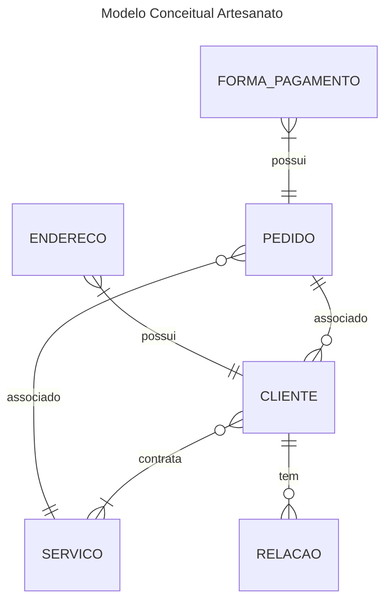
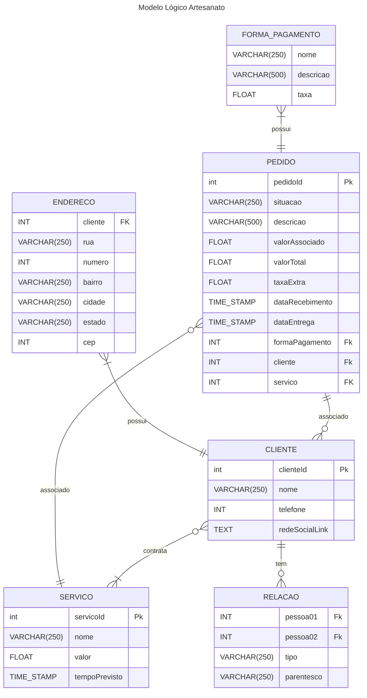

# Artesanato
Atividade para a diciplina de banco de dados para a criação de modelos ORM no django. 
O prestador de serviço escolhido foi o artesão, pois utilizarei um projeto com este dominío na matéria de interfaces ricas e esta é uma oportunidade de um ponta pé inicial para a implementação do backend. Ademais, o escopo cumpre um bom propósito para demonstração da atividade requisitada.

## Modelo de dados

